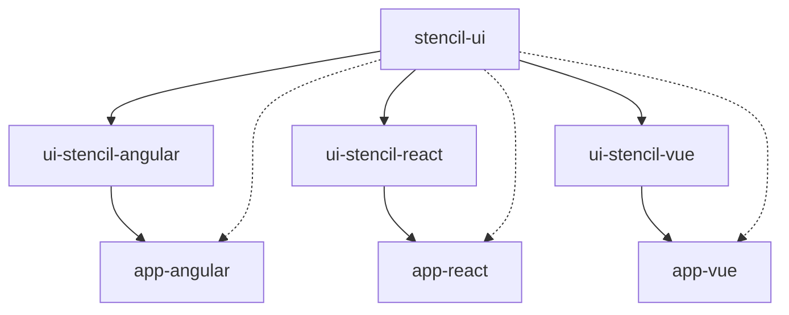

<div align="center">
  <h2 align="center"><strong>Stencil Design System</strong></h2>
  <p align="center">
    Component Library for a Design System using Stencil and Turborepo
  </p>

</div>

<br/>

## Structure

This monorepo contains multiple projects that work together to create an integrated Design System

### Packages

> Packages are reusable libraries available for packages and apps

| Package directory             | Description                                         |
| ----------------------------- | --------------------------------------------------- |
| `packages/ui-stencil`         | Component library                                   |
| `packages/ui-stencil-angular` | Official Wrapper that improves Stencil with Angular |
| `packages/ui-stencil-react`   | Official Wrapper that improves Stencil with React   |
| `packages/ui-stencil-vue`     | Official Wrapper that improves Stencil with Vue     |

### Apps

> Apps can use all the available packages

| App directory      | Description                                       |
| ------------------ | ------------------------------------------------- |
| `apps/storybook`   | Storybook building environment                    |
| `apps/app-angular` | Test App that uses the ui-stencil-angular library |
| `apps/app-react`   | Test App that uses the ui-stencil-react library   |
| `apps/app-vue`     | Test App that uses the ui-stencil-vue library     |

### Config

> Config are reusable eslint and typescript configurations

| Package directory | Description                           |
| ----------------- | ------------------------------------- |
| `config/`         | Shared configuration for all packages |

### Tools

> Tools to generate Components, fetch Tokens or update dependencies

| App directory | Description   |
| ------------- | ------------- |
| `tools/maintenance`      | CLI Tool that updates all packages dependencies |

<br/>

## Development

These instructions will get you a copy of the project up and running on your local machine for development and testing purposes. See deployment for notes on how to deploy the project on a live system.

Make sure you have the LTS version of [Node](https://nodejs.dev/) (18.7) installed in your machine. We recommend to use [nvm (Node Version Manager)](https://github.com/nvm-sh/nvm).

This monorepository uses Turborepo to manage dependencies and scripts. The first step is to install the local node dependencies:

```sh
pnpm install
```

### Development with Storybook

```shell
pnpm run dev
```

<br/>

## Architecture



---

Made by [@chepetime](https://github.com/chepetimetime) at Mexico City 🇲🇽
